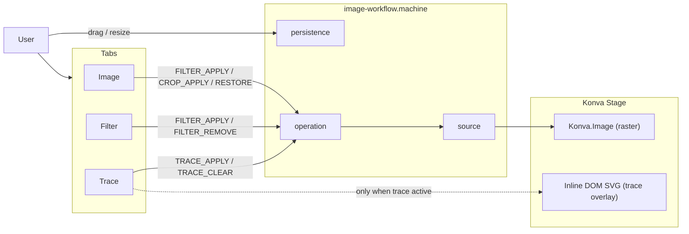
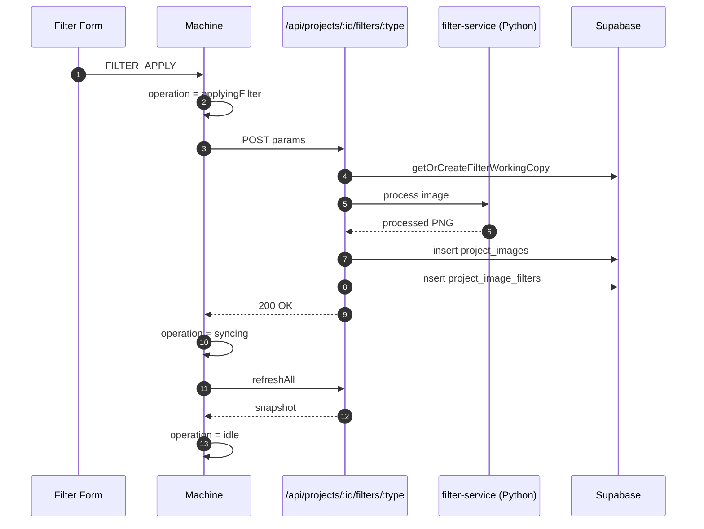
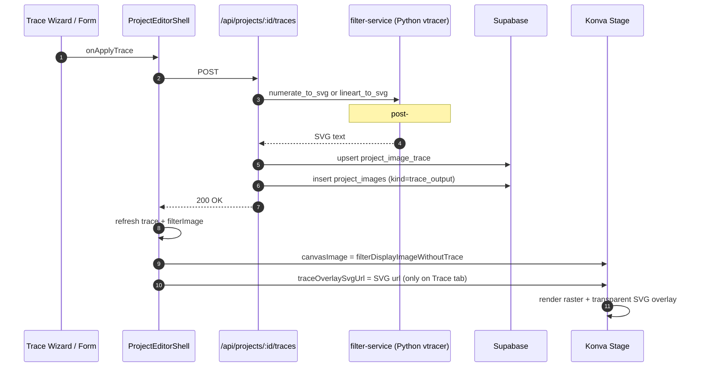
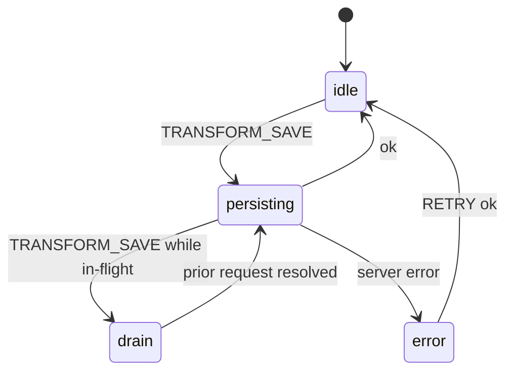
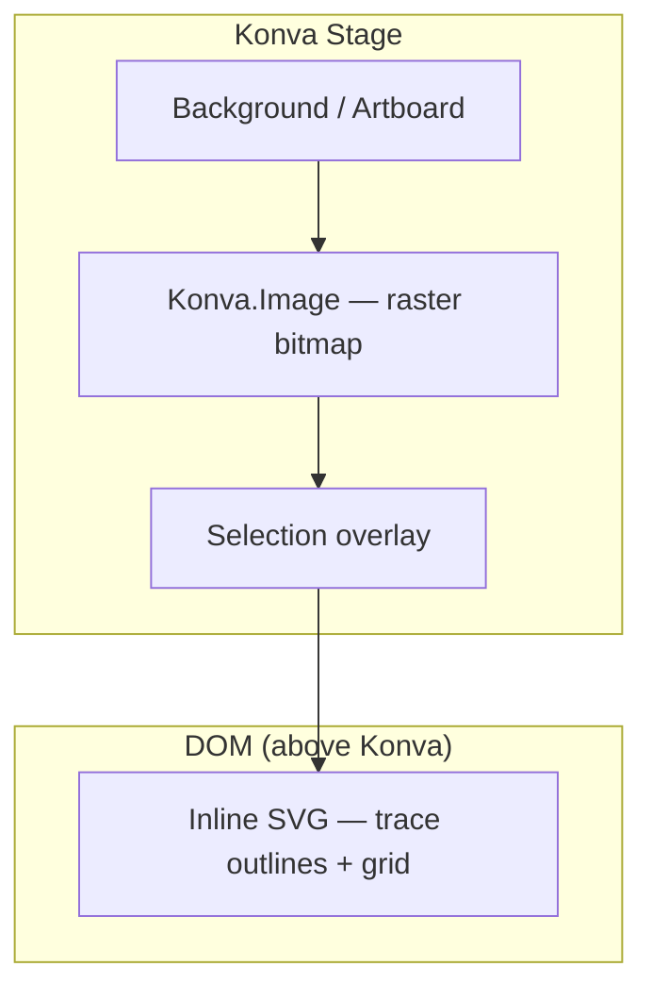

# Image Editor

## Purpose

The editor is where users open a project, see the canvas with the
master image, place / scale / rotate it on the artboard, apply a
filter chain (pixelate / lineart / numerate), and persist the
result. It splits into three layers: pure-math canvas model
(`lib/editor/`), Konva render + XState orchestration
(`features/editor/`), and server-side image operations
(`services/editor/`).

## Where it lives

- [lib/editor/](../../lib/editor/) — pure logic: pan/zoom math
  (`canvas-model.ts`), unit conversions (`units.ts`,
  `fixed-units.ts`), image kind + placement
  (`image-kind.ts`, `image-placement.ts`),
  [machines/image-workflow.machine.ts](../../lib/editor/machines/image-workflow.machine.ts)
  (XState orchestration), [konva/](../../lib/editor/konva/),
  [layers/](../../lib/editor/layers/),
  [imageState/](../../lib/editor/imageState/),
  [filters/](../../lib/editor/filters/) (filter registry).
- [features/editor/](../../features/editor/) — React surface:
  `ProjectEditorStage`, the floating section model. Navigation and
  functions are split into two floating-pill bars: `EditorNav`
  (Home + the four section icons — pure navigation, switches
  `editorSection`) as a horizontal row bottom-centre, and `EditorTopBar`
  (the active section's function frames — `EditorFunctionList`, always
  visible, driving apply/edit/delete) top-right, beneath the theme bar.
  The canvas `FloatingToolbar` (tools + zoom/fit/rotate) is a vertical
  pill on the right edge. Per-surface scopes drive the trace
  `TraceSheet` and the artboard section's three standalone
  dialogs `ArtboardSheet` (artboard size + page-background) /
  `GridSheet` / `ImageSheet`, each launched by its own
  artboard "+" frame and routed through `ArtboardSurfaceScope`'s
  `activeDialog`; `EditorTopRightBar` carries only the theme toggle
  and Trace's Eye (view-options). All dialogs/sheets render the same
  fullscreen presentation on every viewport — desktop matches mobile
  (no bounded right-side cards, no side-by-side trace dialog). Plus
  the form components for each filter (`pixelate-form.tsx`,
  `lineart-form.tsx`, `numerate-form.tsx`), navigation/section routing.
- [services/editor/](../../services/editor/) — server-side ops:
  artboard display (`artboard-display.ts`), image sizing
  (`image-sizing.ts`, `image-sizing-operations.ts`), workspace
  ops (`workspace-operations.ts`), and the heavy lifters in
  [server/](../../services/editor/server/) (master-image upload,
  crop, filter variants, working-copy management).
- DB: `project_workspace`, `project_image_state`, `project_images`,
  `project_image_filters`, `project_grid` — see
  [docs/domains/database.md](database.md).

## Key concepts

- **Pure model + Konva renderer split.** `lib/editor/canvas-model.ts`
  is pure math (fit/pan/zoom, no DOM); `features/editor/components/`
  wires Konva. Tests live next to the math, not the UI.
- **`px_u` everywhere a number is persisted.** Coordinates and
  sizes that hit the DB are stored as `text` "micro-pixels" (1µpx
  = 1/1000 px) to dodge floating-point drift across save/load. See
  [docs/domains/image-state.md](image-state.md) and
  [docs/specs/sizing-invariants.mdx](../specs/sizing-invariants.mdx).
- **Image `kind` enum**: `master | working_copy | filter_working_copy | trace_output | trace_base`
  on `project_images.kind`. Master is immutable (DB trigger
  `guard_master_immutable`); working copies are throwaway scratch.
  `trace_output` (PR #119) is the SVG sink for pixelate / lineart;
  it sits outside the filter chain and is referenced by
  `project_image_trace.output_image_id`. `trace_base` is the
  cropped source bitmap that pixelate writes alongside the SVG; it
  is Python-service data for cell-colour sampling and is **not**
  rendered on the canvas (PR #262 — the canvas stays on the
  working_copy / filter tip with the SVG overlaid on top).
- **State is anchored at `working_copy.id` (PR #257, re-anchored
  from master.id / PR #124).** Every `project_image_state` row's
  `image_id` is the project's working_copy row id. The API route
  ([app/api/projects/[projectId]/image-state/route.ts](../../app/api/projects/%5BprojectId%5D/image-state/route.ts))
  resolves to working_copy.id on both GET and POST via
  `resolveStateAnchorImage` in
  [lib/supabase/image-state.ts](../../lib/supabase/image-state.ts).
  The body's `image_id` identifies which editor surface the user
  was operating on (used for the in-project + lock-guard check) —
  it is **not** the persistence key.
- **`set_active_image_with_state` is the canonical bind RPC for
  master swaps.** It links a `project_images` row to the
  `project_image_state` row in one transaction and is used by
  the restore/replace-master flow at
  [app/api/projects/[projectId]/images/master/restore/route.ts](../../app/api/projects/%5BprojectId%5D/images/master/restore/route.ts).
  Editor transforms (drag / resize / inputs) go through the
  image-state route instead.
- **Filter chain runs in two phases.** Frontend dispatches per-
  filter forms via a registry (see
  [docs/reference/filter-stack-findings.md](../reference/filter-stack-findings.md));
  server appends a row to `project_image_filters` and triggers
  the Python filter-service for actual pixel work. The result
  comes back as a new image with `kind='filter_working_copy'`.
- **XState orchestrates image work.** Long flows (upload, restore,
  crop, master-switch) live in `image-workflow.machine.ts` so
  intermediate states are explicit and testable.

## Data flow — restoring a master

```
user clicks "restore" in the Image dialog (EditorImageDialogs host)
   → restore/route.ts
     ├── load baseMaster from project_images
     ├── compute placement via lib/editor/image-placement
     ├── set_active_image_with_state RPC (atomic bind)
     └── 200 { ok: true }
   ← UI re-renders from new project_image_state row
```

## Conventions

- **Never write to `project_image_state` directly.** Go through
  `set_active_image_with_state` (binds with the active master) or
  the typed helpers in `lib/supabase/image-state.ts`.
- **Every coord/size persisted is `*_px_u: text`**, not `numeric`.
  The numeric-from-string conversions live in
  `lib/editor/numeric.ts` + `lib/editor/units.ts`.
- **Filter forms always go through the registry** at
  `lib/editor/filters/`; don't add a form component that talks to
  the filter API on its own.
- **PascalCase for top-level container components**
  (`ProjectEditorStage.tsx`, `ProjectEditorLayout.tsx`) per
  [docs/conventions.md](../conventions.md). Atomic primitives are
  kebab-case.

## Process baseline (post-merge 2026-05-12)

Captures the user-facing flow across the three active editor tabs
and the invariants the trace-overlay series (#76 → #82 → #83 →
#84 → #86), the working_copy re-anchor (#257, from the original
master-anchor #119/#124), and the non-destructive trace-overlay
refactor (#260 non-destructive pixelate, #262 SVG-only overlay)
established. Update this section when those invariants change.

### Tabs

The canvas always renders the working_copy (or its filter chain
tip) via `filterDisplayImageWithoutTrace`; all three tabs use the
same source and render at the same `project_image_state` rect. On
the Trace tab the trace SVG overlays on top via `TraceInlineSvg`,
positioned at that rect. Pixelate apply is **non-destructive**: it
does NOT mutate `project_image_state` — the SVG's viewBox is the
source crop, and clear-trace simply removes the overlay (the
`master_pre_*_px_u` restore columns were dropped, migration
`20260521205316_drop_trace_master_pre_state.sql`). The `trace_base`
bitmap is Python-service data for cell-colour sampling and is
**not** rendered on the canvas (PR #262 — preferring it routed the
canvas through trace_base's source-crop intrinsic and rendered the
trace at the original image proportions; that bug class is closed).
The master image is never the canvas source — it's an immutable
restore source surfaced through the layer tree; the **persistence
anchor** for `project_image_state` is the working_copy (PR #257).

| Tab | Sidebar | State read | State written | Stage display |
|---|---|---|---|---|
| **Image** | layers (`editor-nav-tree`) | `project_image_state` at working_copy.id | `project_image_state` at working_copy.id | working_copy / filter-tip raster |
| **Filter** | "+" kind-menu (`EditorTopBar`) — apply / remove / unlock | `project_image_filters` + `filter_working_copy` rows; `project_image_state` at working_copy.id | `project_image_filters`, `project_images(kind='filter_working_copy')`, `project_image_state` at working_copy.id | filter chain tip raster |
| **Trace** | trace section (`TraceSidebarSection`) | `project_image_trace`, `project_image_state` at working_copy.id | `project_image_trace` (single row), `project_images(kind='trace_output'/'trace_base')` — `project_image_state` is **not** mutated (non-destructive) | working_copy / filter-tip raster + inline-SVG overlay, positioned at `project_image_state` for working_copy.id |
| Colors / Output | — | — | — | removed 2026-05-11 (PR #89) |

### Section locks

Each layer derives from the previous one (Master → Filter → Trace).
Editing a layer that has a downstream artefact silently invalidates
the artefact — the filter's input or the trace's input changed
underneath it. The editor protects this with a **derived** lock on
the upstream section: data presence drives the state, no DB column
is involved (the unused `project_images.is_locked` column predates
this and is not touched).

The derivation is a pure function in
[lib/editor/section-locks.ts](../../lib/editor/section-locks.ts).
The table the function implements:

| State                        | imageLocked | imageToggleable | filterLocked | filterToggleable |
|------------------------------|-------------|-----------------|--------------|------------------|
| Only Master                  | false       | —               | false        | —                |
| + Filter                     | true        | true            | false        | —                |
| + Filter + Trace             | true        | true            | true         | true             |
| Only Trace (no Filter)       | true        | true            | true         | **false**        |

The "trace-only" row is the asymmetric one: there is no filter to
keep editable, so the Filter section locks without an unlock
affordance. The only path forward is dropping the trace from its
own section (which has no upstream dependency and is always
editable).

**Surfaces:**

- Desktop nav-tree (`LockNavTreeActions`): Lock-icon next to the
  image row's Trash; clicking opens the unlock confirm dialog.
- Filter section ("+" kind-menu): while locked the active kind rows
  swap their Delete circle for an Unlock lead, and applying new
  kinds is disabled.
- Image panel (`ImagePanel`): banner above the size/position/
  alignment inputs; `useImagePanelEnabled({ locked })` is the
  single disable point.
- Bottom nav (all viewports): red dot on the Artboard (image-lock)
  and Filter icons.

**Unlock cascade order** (in `ProjectEditorShell.client.tsx`):
trace first (single `clearProjectTrace` call), then filters
top-down via repeated `removeProjectImageFilter`. Top-down is the
cheap order — each removal leaves `after = []` in
`filter-variants.ts` and skips the chain-rebuild that a
from-the-middle remove would trigger.

Tests: [lib/editor/section-locks.test.ts](../../lib/editor/section-locks.test.ts)
covers the four rows. UI is verified manually.

### Invariants (do not regress)

- **State is anchored at `working_copy.id`.** The API route resolves
  to working_copy.id on every GET/POST regardless of which editor
  surface the client was rendering. Saves survive every filter-base-
  copy recreation, chain reset, or trace tombstone. Body `image_id`
  is informational (lock guard only); the server never persists at it.
  See [docs/domains/image-state.md](image-state.md) for the
  resolver helper (`resolveStateAnchorImage`) and the PR #257
  re-anchor migration that established this invariant.
- **Canvas source picker is `filterDisplayImageWithoutTrace` → stage,
  with a section-override on `signedUrl` for Image/Artboard.**
  `pickCanvasImage` ([lib/editor/canvas-image-invariant.ts](../../lib/editor/canvas-image-invariant.ts))
  always anchors the canvas on the trace-free working copy / filter
  chain tip (`filterDisplayImageWithoutTrace`), falling back to
  `stageImage` while it loads — that's the **ID + dimensions** layer,
  load-bearing for the persistence invariant (`useDisplaySize` /
  image-workflow machine save to whichever row owns the canvas ID;
  see [canvas-image-invariant.ts](../../lib/editor/canvas-image-invariant.ts)
  doc-comment). On the Image / Artboard section the **visible
  `signedUrl`** is overridden to the master URL via the picker's
  `showRawMaster` + `masterSignedUrl` params — the section is "the
  image as uploaded", filter/trace effects belong to their own
  sections. ID + dims still stay on the working copy.
  The trace SVG overlays on top; `trace_base` is **never** the canvas
  source (PR #262 — it had routed the canvas through trace_base's
  source-crop intrinsic and rendered the trace at the original image
  proportions). All sources render at the same `project_image_state`
  rect anchored at working_copy.id, so Image / Filter / Trace tabs
  show identical size + position.
- **`masterSignedUrl` is signed from the `kind='master'` row, not
  the active row.** The master API payload
  ([app/api/projects/[projectId]/images/master/route.ts](../../app/api/projects/%5BprojectId%5D/images/master/route.ts))
  exposes two URLs: `signedUrl` (active row — working_copy /
  filter_working_copy / trace_output chain tip; default canvas
  base, error-boundary reset key, right-panel thumbnail) and
  `masterSignedUrl` (kind='master' row's own `storage_path`;
  consumed only by `pickCanvasImage`'s Image/Artboard override).
  Master and working_copy share `storage_path` until a filter is
  applied (migration step 2 of
  `supabase/migrations/20260521201811_state_anchor_working_copy.sql`)
  — pre-filter the two URLs coincide. The earlier "PR #354" attempt
  to surface the raw master used `signedUrl` for the override and
  silently became a no-op once a filter existed (the active URL
  was the filter tip, swap of filter→filter); shipping the URLs as
  separate fields closes that bug class, and both are cached in
  one entry to prevent expiry drift.
- **Filter operates on raster, never on SVG.** PR #82 fixed a class
  where Filter would be applied to a trace SVG. Filter always reads
  `filterDisplayImageWithoutTrace`.
- **Trace source uses the same active-state resolver as Filter.** PR
  #83 unified the source picker. If you add a new operation that
  reads "the current image", route through the active-state resolver.
- **Trace SVG sits as a DOM-overlay above the canvas.** PR #84 made
  the trace SVG render as a DOM-overlay on top of the Konva.Image,
  not as a replacement. PR #86 dropped the opaque white `<rect>`
  from the Python source so the underlying bitmap shows through.
  The bitmap below the SVG is the working_copy / filter chain tip
  (PR #262 — `trace_base` is no longer the canvas source); the
  overlay architecture is unchanged from #84/#86.
- **Section-owned dialogs auto-dismiss when their surface goes
  inactive.** Trace dialogs (selection, Pixelate configure, Circulate
  configure, generic-trace configure) and Filter dialogs (the twin
  surface) are shell-owned modals. Their state hooks
  ([use-trace-dialog-session](../../lib/editor/hooks/use-trace-dialog-session.ts),
  [use-filter-dialog-session](../../lib/editor/hooks/use-filter-dialog-session.ts))
  take a `surfaceActive: boolean` argument and self-reset to idle
  whenever it flips false. The shell wires this via
  [isSurfaceActive](../../lib/editor/section-active.ts) — the same
  pure helper that ought to be reused anywhere "is the user on
  section X?" needs to be answered. Result: switching tabs/sections
  via any code path (UI, programmatic, future deep-link) dismisses
  the owning dialog automatically; the shell does not have to
  enumerate which dialogs to close. Symmetric with the canvas
  view-flag gates in `deriveDisplayLayers` (PR #357) — section-
  scoped behaviour colocates with what it scopes, not with consumers.
- **Trace view toggles are Trace-section-scoped on effect, not on
  storage.** Three flags — `traceOverlayVisible` (cells/colors),
  `previewBitmapVisible` (Konva.Image underneath), `numbersLayerVisible`
  (labels `<g id="numbers">`) — persist in `SessionState`
  ([lib/editor/hooks/use-editor-session-state.ts](../../lib/editor/hooks/use-editor-session-state.ts))
  so the user's last Trace view preference survives a tab trip. Their
  *canvas effect* is gated on the Trace section being active via
  `deriveDisplayLayers`
  ([lib/editor/display-layers.ts](../../lib/editor/display-layers.ts)) —
  outside Trace, the effective values collapse to `true` so the
  toggles can't leak into the Image / Filter tabs (the
  `previewBitmapVisible=false` case used to hide the bitmap on every
  tab via the un-gated `<KonvaImage>` check at
  `project-canvas-stage.tsx`). The checkbox UI reads the raw session
  values (so a toggle left off stays off); only canvas-bound prop
  chains read the effective values. The gate reuses the same
  `traceSectionActive` check as `traceOverlaySvgUrl`, so the two
  outputs can't drift on whether Trace is "active".
- **Pixelate apply is non-destructive (PR #260).** It does NOT
  mutate `project_image_state` — the cropped grid lives only in the
  trace SVG's viewBox (= the source crop) plus the `trace_base`
  bitmap, overlaid on the unchanged working_copy rect. The earlier
  destructive-crop model (writing cropped dims to
  `project_image_state`, with a `project_image_trace.master_pre_*_px_u`
  restore rect) was removed; those restore columns were dropped
  (migration `20260521205316_drop_trace_master_pre_state.sql`).
  Clear-trace just removes the overlay. Image / Filter / Trace stay
  visually consistent because they share one working_copy rect.
- **`traceOverlaySvgUrl` is gated on Trace-tab AND trace-aware ≠
  trace-free display IDs.** Otherwise the overlay either shows the
  wrong thing (on Filter/Image tab) or shows nothing useful (when
  there is no real trace artefact).
- **Layer-edit protection is derived, not stored.** A section is
  locked iff downstream data exists; the lock disappears the moment
  the downstream is gone (no DB write needed). Never reintroduce an
  `is_locked` column or a server-side lock toggle — the derivation
  is the source of truth. See "Section locks" above.

### State machine

[lib/editor/machines/image-workflow.machine.ts](../../lib/editor/machines/image-workflow.machine.ts)
runs three parallel sub-machines:

- `source` — `loading` / `ready` / `empty` / `error`. Reflects
  whether an active image is available.
- `operation` — `idle` / `applyingFilter` / `removingFilter` /
  `cropping` / `restoring` / `syncing` / `error`. Each terminal
  state passes through `syncing` (calls `refreshAll`) before
  returning to `idle`.
- `persistence` — `idle` / `persisting` / `drain` / `error`.
  Drain-queue absorbs rapid `TRANSFORM_SAVE` events so transforms
  aren't lost on fast user moves.

### Risks tracked (not yet addressed)

- `useEditorSessionState` has no schema-version key — a struct
  change crashes the editor on first reload of an existing user
  tab.
- `useMutationLeaveGuard` only covers in-flight server mutations,
  not dialog dirty state.
- `ProjectEditorShell.client.tsx` derives `canvasMode`,
  `canvasImage`, and `traceOverlaySvgUrl` inline; many imports.
- Crop output no longer scales canvas-displayed size proportionally
  to the crop ratio (`copyImageTransform` was removed because the
  state row is unaware of per-step dimension changes). If
  proportional scale-down is needed, reintroduce as a targeted
  working_copy.id state update inside `cropImageVariant`.
- A follow-up cleanup migration is pending (PR #124 left legacy
  `project_image_state` rows whose `image_id` is not the master
  in place, for deploy-window compatibility — drop them after bake).
- `activateProjectImage` writes a state row at the activated image
  id (filter_working_copy / trace_output) via
  `set_active_image_with_state` RPC. These rows are never read
  (the route always loads at working_copy.id) but accumulate as DB
  cruft. The pending cleanup migration above sweeps them.

## Diagrams

These diagrams are part of the doc contract. If you change
`image-workflow.machine.ts` states or events, an `app/api/` route
path, or the render-layer composition in `project-canvas-stage.tsx`,
update the matching diagram in the same PR.

### Tab + state-machine overview



### Filter pipeline lifecycle



### Trace pipeline + overlay composition



### Persistence drain queue



### Render layers



## Common pitfalls

- **Forgetting `kind` filter on `project_images` queries.** Without
  `where kind = 'master'` (or matching), you'll pick up working
  copies. The recent `role → kind` migration broke older queries
  that used `role`.
- **Touching the master row directly.** The `guard_master_immutable`
  trigger rejects edits unless `app.deleting_project` is set. Use
  the bind RPC or replace the master via a new row.
- **Mixing `px` and `px_u` in the same calculation.** `px_u` is a
  string of micro-pixels; multiplying it by a number without going
  through `units.ts` helpers produces NaN.
- **Long-running canvas work without XState.** State racing across
  upload + filter + crop produces "ghost previews". Add a state to
  `image-workflow.machine.ts` instead.

## Cross-references

- [docs/domains/image-state.md](image-state.md) — `project_image_state`
  binding details, `px_u` semantics.
- [docs/domains/filter-pipeline.md](filter-pipeline.md) — full
  filter-stack flow.
- [docs/domains/storage.md](storage.md) — image upload/storage path
  conventions.
- [docs/specs/image-state-api.mdx](../specs/image-state-api.mdx),
  [docs/specs/sizing-invariants.mdx](../specs/sizing-invariants.mdx)
  — formal specs.
- [docs/reference/persistence.md](../reference/persistence.md) — save flow detail.
- Code: [lib/editor/canvas-model.ts](../../lib/editor/canvas-model.ts),
  [lib/editor/machines/image-workflow.machine.ts](../../lib/editor/machines/image-workflow.machine.ts).
