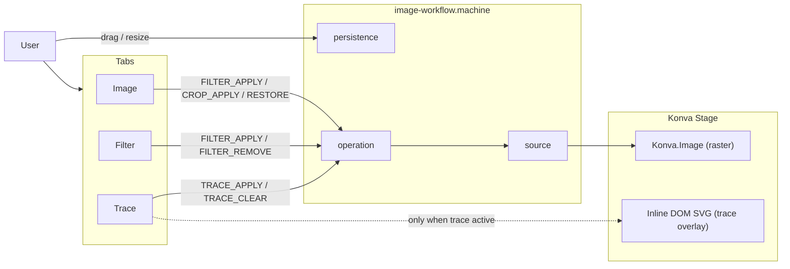
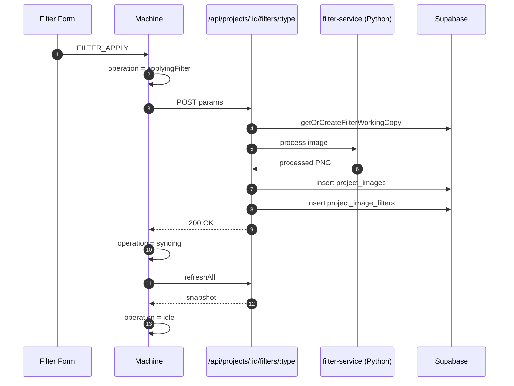
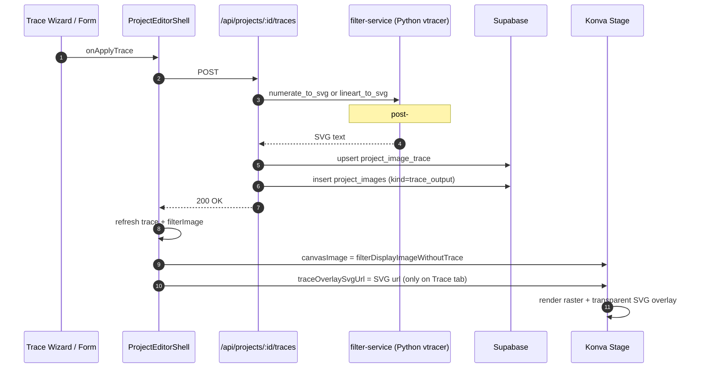
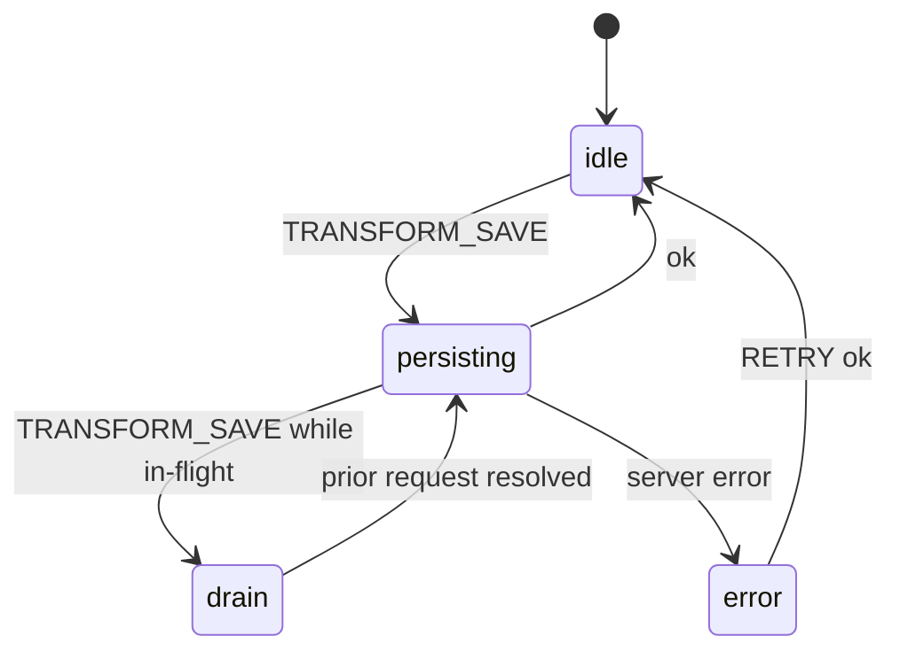
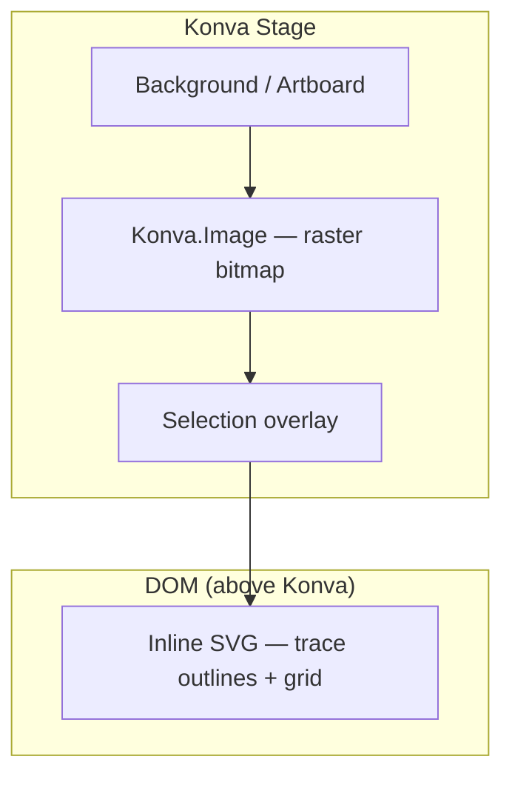

# Image Editor

## Purpose

The editor is where users open a project, see the canvas with the
master image, place / scale / rotate it on the artboard, apply a
filter chain (pixelate / lineart / numerate), and persist the
result. It splits into three layers: pure-math canvas model
(`lib/editor/`), Konva render + XState orchestration
(`features/editor/`), and server-side image operations
(`services/editor/`).

## Where it lives

- [lib/editor/](../../lib/editor/) — pure logic: pan/zoom math
  (`canvas-model.ts`), unit conversions (`units.ts`,
  `fixed-units.ts`), image kind + placement
  (`image-kind.ts`, `image-placement.ts`),
  [machines/image-workflow.machine.ts](../../lib/editor/machines/image-workflow.machine.ts)
  (XState orchestration), [konva/](../../lib/editor/konva/),
  [layers/](../../lib/editor/layers/),
  [imageState/](../../lib/editor/imageState/),
  [filters/](../../lib/editor/filters/) (filter registry).
- [features/editor/](../../features/editor/) — React surface:
  `ProjectEditorStage`, `ProjectEditorRightPanel`, the form
  components for each filter (`pixelate-form.tsx`,
  `lineart-form.tsx`, `numerate-form.tsx`),
  navigation/section routing.
- [services/editor/](../../services/editor/) — server-side ops:
  artboard display (`artboard-display.ts`), image sizing
  (`image-sizing.ts`, `image-sizing-operations.ts`), workspace
  ops (`workspace-operations.ts`), and the heavy lifters in
  [server/](../../services/editor/server/) (master-image upload,
  crop, filter variants, working-copy management).
- DB: `project_workspace`, `project_image_state`, `project_images`,
  `project_image_filters`, `project_grid` — see
  [docs/domains/database.md](database.md).

## Key concepts

- **Pure model + Konva renderer split.** `lib/editor/canvas-model.ts`
  is pure math (fit/pan/zoom, no DOM); `features/editor/components/`
  wires Konva. Tests live next to the math, not the UI.
- **`px_u` everywhere a number is persisted.** Coordinates and
  sizes that hit the DB are stored as `text` "micro-pixels" (1µpx
  = 1/1000 px) to dodge floating-point drift across save/load. See
  [docs/domains/image-state.md](image-state.md) and
  [docs/specs/sizing-invariants.mdx](../specs/sizing-invariants.mdx).
- **Image `kind` enum**: `master | working_copy | filter_working_copy | trace_output | trace_base`
  on `project_images.kind`. Master is immutable (DB trigger
  `guard_master_immutable`); working copies are throwaway scratch.
  `trace_output` (PR #119) is the SVG sink for pixelate / lineart;
  it sits outside the filter chain and is referenced by
  `project_image_trace.output_image_id`. `trace_base` is the
  cropped source bitmap that pixelate writes alongside the SVG —
  the editor renders it under the SVG overlay on the Trace tab so
  the crop region is the only thing visible.
- **State is anchored at `master.id` (PR #124).** Every
  `project_image_state` row's `image_id` is the project's master
  row id — the stable, immutable anchor. The API route
  ([app/api/projects/[projectId]/image-state/route.ts](../../app/api/projects/%5BprojectId%5D/image-state/route.ts))
  resolves to master.id on both GET and POST via
  `getProjectMasterImageId` in
  [lib/supabase/project-images.ts](../../lib/supabase/project-images.ts).
  The body's `image_id` identifies which editor surface the user
  was operating on (used for the in-project + lock-guard check) —
  it is **not** the persistence key.
- **`set_active_master_with_state` is the canonical bind RPC for
  master swaps.** It links a `project_images` row to the
  `project_image_state` row in one transaction and is used by
  the restore/replace-master flow at
  [app/api/projects/[projectId]/images/master/restore/route.ts](../../app/api/projects/%5BprojectId%5D/images/master/restore/route.ts).
  Editor transforms (drag / resize / inputs) go through the
  image-state route instead.
- **Filter chain runs in two phases.** Frontend dispatches per-
  filter forms via a registry (see
  [docs/reference/filter-stack-findings.md](../reference/filter-stack-findings.md));
  server appends a row to `project_image_filters` and triggers
  the Python filter-service for actual pixel work. The result
  comes back as a new image with `kind='filter_working_copy'`.
- **XState orchestrates image work.** Long flows (upload, restore,
  crop, master-switch) live in `image-workflow.machine.ts` so
  intermediate states are explicit and testable.

## Data flow — restoring a master

```
user clicks "restore" in right panel
   → restore/route.ts
     ├── load baseMaster from project_images
     ├── compute placement via lib/editor/image-placement
     ├── set_active_master_with_state RPC (atomic bind)
     └── 200 { ok: true }
   ← UI re-renders from new project_image_state row
```

## Conventions

- **Never write to `project_image_state` directly.** Go through
  `set_active_master_with_state` (binds with the active master) or
  the typed helpers in `lib/supabase/image-state.ts`.
- **Every coord/size persisted is `*_px_u: text`**, not `numeric`.
  The numeric-from-string conversions live in
  `lib/editor/numeric.ts` + `lib/editor/units.ts`.
- **Filter forms always go through the registry** at
  `lib/editor/filters/`; don't add a form component that talks to
  the filter API on its own.
- **PascalCase for top-level container components**
  (`ProjectEditorStage.tsx`, `ProjectEditorRightPanel.tsx`) per
  [docs/conventions.md](../conventions.md). Atomic primitives are
  kebab-case.

## Process baseline (post-merge 2026-05-12)

Captures the user-facing flow across the three active editor tabs
and the invariants the trace-overlay series (#76 → #82 → #83 →
#84 → #86) and the master-anchor refactor (#119, #124) established.
Update this section when those invariants change.

### Tabs

The canvas source depends on the tab. Image and Filter render the
trace-free filter chain tip (`filterDisplayImageWithoutTrace`).
Trace swaps the canvas source to `trace_base` (the cropped source
bitmap) when a trace exists, with the inline-SVG overlay sitting
on top. The trace's display rect is centred on the master's
bounding box, sized to the floor-grid crop, and frozen at
apply-time — mid-session resizes of the master don't reflow the
trace. The master image itself is never the canvas source — it's
an immutable restore source surfaced through the layer tree, and
it serves as the **persistence anchor** for `project_image_state`
(PR #124).

| Tab | Sidebar | State read | State written | Stage display |
|---|---|---|---|---|
| **Image** | layers (`editor-nav-tree`) | `project_image_state` at master.id | `project_image_state` at master.id | filter-base-copy raster |
| **Filter** | filter stack (`FilterSidebarSection`) | `project_image_filters` + `filter_working_copy` rows; `project_image_state` at master.id | `project_image_filters`, `project_images(kind='filter_working_copy')`, `project_image_state` at master.id | filter chain tip raster |
| **Trace** | trace section (`TraceSidebarSection`) | `project_image_trace` (incl. `display_*_px_u` rect), filter chain tip raster | `project_image_trace` (single row, with persisted display rect), `project_images(kind='trace_output'/'trace_base')`, `project_image_state` at master.id | `trace_base` bitmap at its persisted display rect + inline-SVG overlay |
| Colors / Output | — | — | — | removed 2026-05-11 (PR #89) |

### Invariants (do not regress)

- **State is anchored at `master.id`.** The API route resolves to
  master.id on every GET/POST regardless of which editor surface
  the client was rendering. Saves survive every filter-base-copy
  recreation, chain reset, or trace tombstone. Body `image_id` is
  informational (lock guard only); the server never persists at it.
  See [docs/domains/image-state.md](image-state.md) for the
  resolver helper and the backfill that established this invariant.
- **Canvas source picker is `traceBaseImage` → `filterDisplayImage` → stage.**
  The master image (`kind='master'`) is immutable
  (`guard_master_immutable` trigger) and is never the Konva render
  source. `pickCanvasImage` ([lib/editor/canvas-image-invariant.ts](../../lib/editor/canvas-image-invariant.ts))
  prefers `trace_base` when a trace exists (Trace tab) — it
  renders at its own persisted display rect from
  `project_image_trace.display_*_px_u` (PR #239), centred on the
  master's bounding box and frozen at apply-time. Otherwise the
  canvas falls back to the trace-free filter chain tip
  (`filterDisplayImageWithoutTrace`). The persistence decoupling
  above means a drift between canvas-source id and save-target id
  no longer silently breaks the user — saves still land at
  master.id.
- **Filter operates on raster, never on SVG.** PR #82 fixed a class
  where Filter would be applied to a trace SVG. Filter always reads
  `filterDisplayImageWithoutTrace`.
- **Trace source uses the same active-state resolver as Filter.** PR
  #83 unified the source picker. If you add a new operation that
  reads "the current image", route through the active-state resolver.
- **Trace SVG sits as a DOM-overlay above the canvas.** PR #84 made
  the trace SVG render as a DOM-overlay on top of the Konva.Image,
  not as a replacement. PR #86 dropped the opaque white `<rect>`
  from the Python source so the underlying bitmap shows through.
  Post-PR-#239 the bitmap below the SVG is `trace_base` (the
  cropped source) on the Trace tab, not the filter chain tip — but
  the overlay architecture is unchanged.
- **`traceOverlaySvgUrl` is gated on Trace-tab AND trace-aware ≠
  trace-free display IDs.** Otherwise the overlay either shows the
  wrong thing (on Filter/Image tab) or shows nothing useful (when
  there is no real trace artefact).

### State machine

[lib/editor/machines/image-workflow.machine.ts](../../lib/editor/machines/image-workflow.machine.ts)
runs three parallel sub-machines:

- `source` — `loading` / `ready` / `empty` / `error`. Reflects
  whether an active image is available.
- `operation` — `idle` / `applyingFilter` / `removingFilter` /
  `cropping` / `restoring` / `syncing` / `error`. Each terminal
  state passes through `syncing` (calls `refreshAll`) before
  returning to `idle`.
- `persistence` — `idle` / `persisting` / `drain` / `error`.
  Drain-queue absorbs rapid `TRANSFORM_SAVE` events so transforms
  aren't lost on fast user moves.

### Risks tracked (not yet addressed)

- `useEditorSessionState` has no schema-version key — a struct
  change crashes the editor on first reload of an existing user
  tab.
- `useMutationLeaveGuard` only covers in-flight server mutations,
  not dialog dirty state.
- `ProjectEditorShell.client.tsx` derives `canvasMode`,
  `canvasImage`, and `traceOverlaySvgUrl` inline; many imports.
- Crop output no longer scales canvas-displayed size proportionally
  to the crop ratio (PR #124 side-effect — `copyImageTransform`
  was removed because state lives at master.id, which is unaware
  of per-step dimension changes). If proportional scale-down is
  needed, reintroduce as a targeted master.id state update inside
  `cropImageVariant`.
- A follow-up cleanup migration is pending (PR #124 left legacy
  `project_image_state` rows whose `image_id` is not the master
  in place, for deploy-window compatibility — drop them after bake).
- `activateProjectImage` writes a state row at the activated image
  id (filter_working_copy / trace_output) via
  `set_active_master_with_state` RPC. These rows are never read
  (the route always loads at master.id) but accumulate as DB
  cruft. The pending cleanup migration above sweeps them.

## Diagrams

These diagrams are part of the doc contract. If you change
`image-workflow.machine.ts` states or events, an `app/api/` route
path, or the render-layer composition in `project-canvas-stage.tsx`,
update the matching diagram in the same PR.

### Tab + state-machine overview



### Filter pipeline lifecycle



### Trace pipeline + overlay composition



### Persistence drain queue



### Render layers



## Common pitfalls

- **Forgetting `kind` filter on `project_images` queries.** Without
  `where kind = 'master'` (or matching), you'll pick up working
  copies. The recent `role → kind` migration broke older queries
  that used `role`.
- **Touching the master row directly.** The `guard_master_immutable`
  trigger rejects edits unless `app.deleting_project` is set. Use
  the bind RPC or replace the master via a new row.
- **Mixing `px` and `px_u` in the same calculation.** `px_u` is a
  string of micro-pixels; multiplying it by a number without going
  through `units.ts` helpers produces NaN.
- **Long-running canvas work without XState.** State racing across
  upload + filter + crop produces "ghost previews". Add a state to
  `image-workflow.machine.ts` instead.

## Cross-references

- [docs/domains/image-state.md](image-state.md) — `project_image_state`
  binding details, `px_u` semantics.
- [docs/domains/filter-pipeline.md](filter-pipeline.md) — full
  filter-stack flow.
- [docs/domains/storage.md](storage.md) — image upload/storage path
  conventions.
- [docs/specs/image-state-api.mdx](../specs/image-state-api.mdx),
  [docs/specs/sizing-invariants.mdx](../specs/sizing-invariants.mdx)
  — formal specs.
- [docs/reference/persistence.md](../reference/persistence.md) — save flow detail.
- Code: [lib/editor/canvas-model.ts](../../lib/editor/canvas-model.ts),
  [lib/editor/machines/image-workflow.machine.ts](../../lib/editor/machines/image-workflow.machine.ts).
